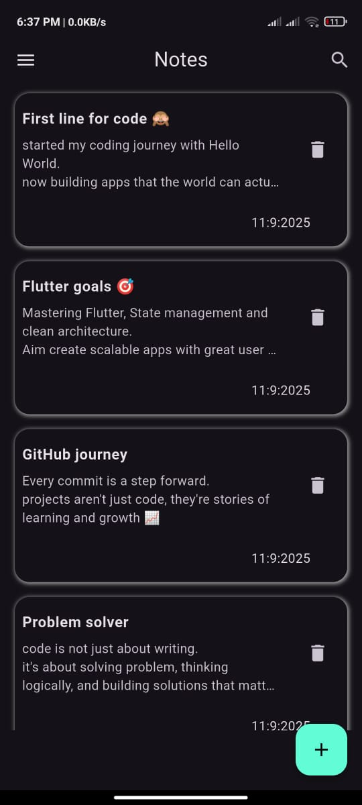
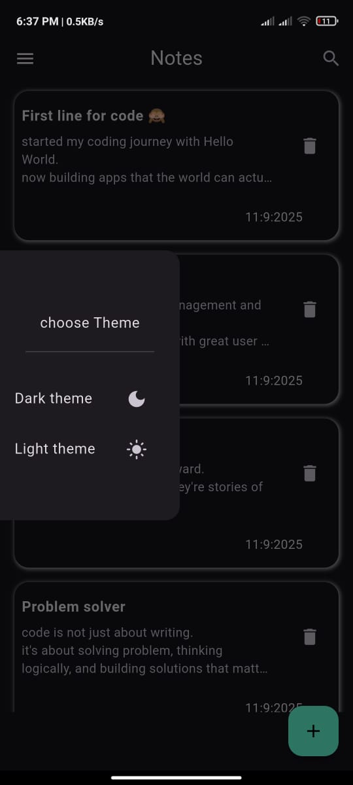
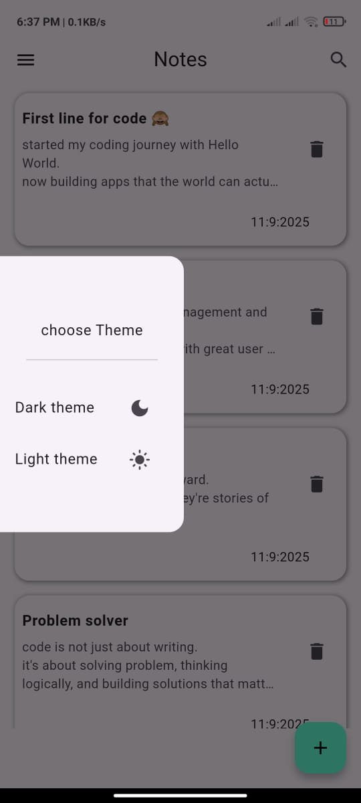
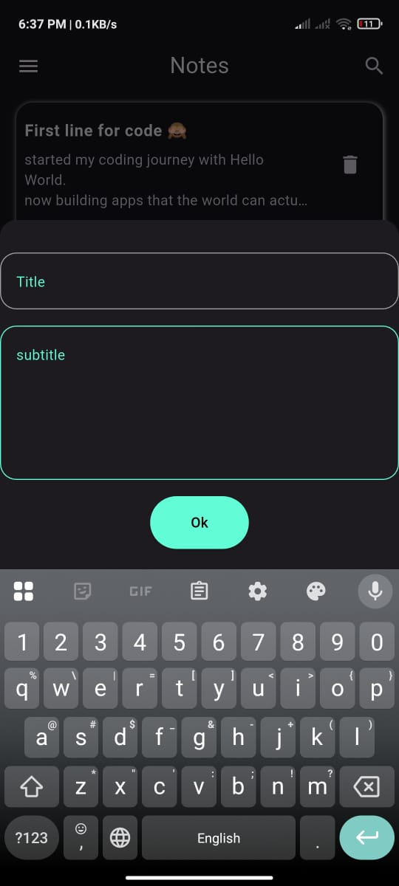
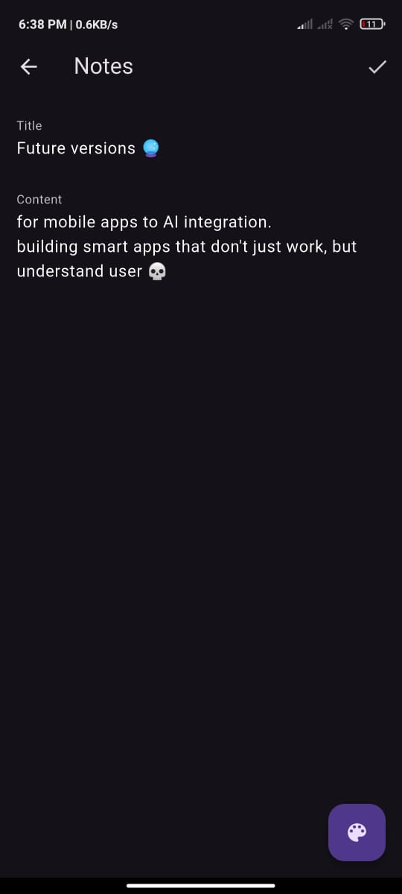

# Notes App 📝

## 📌 Overview
A customizable **Notes Application** built with **Flutter**.  
This app lets users create, edit, and delete notes, with **local storage powered by Hive**.  
It also provides a **theme switcher** (Dark/Light) and a **color picker** to customize note text colors for a more personalized experience.

## 🛠️ Technologies & Tools
- **Flutter & Dart**
- **Hive** (Local NoSQL Database)
- **Cubit** (State Management)
- **OOP Principles & Clean Architecture**

## 🚀 Features
- 📝 Add, edit, and delete notes easily
- 🎨 Color Picker → choose your note text color
- 🌙 Theme Switcher → Dark mode / Light mode via Drawer
- 📱 Responsive design that works across screen sizes
- ⚡ Persistent storage with Hive for offline use
- 🛠️ State management using Cubit for clean logic separation

## 📱 Screens
- **Home Screen** → Displays all saved notes, tap on any note to edit
- **Add/Edit Screen** → Create a new note or update an existing one
- **Drawer** → Switch theme (dark/light)

## 🖼️ Screenshots

| Home Screen                          | Drawer                              | Light  Mode                            | Add Note                           | Edit Note                            | Color Picker                              | 
|--------------------------------------|-------------------------------------|----------------------------------------|------------------------------------|--------------------------------------|-------------------------------------------|
|  |  |  |  |  |  |

## 📂 Project Structure
- `lib/cubits/` → Business logic with Cubit
- `lib/models/` → Note model
- `lib/views/` → Home, Add/Edit Note, etc.
- `lib/views/widgets/` → Reusable components (inputs, buttons, etc.)

## 🚧 Future Improvements
- 🔍 **Search functionality** → find notes quickly by keyword
- ⏰ **Reminders/Notifications** → set alerts for important notes
- ☁️ **Cloud Sync** → backup notes with Firebase or Google Drive
- 📌 **Pin/Archive Notes** → keep important notes on top
- 🔒 **Password Protection** → secure sensitive notes

## ▶️ Demo
[Download APK](https://drive.google.com/file/d/18OWOiuoeHXkAaOFTsT0FT5FhrhPrz4ly/view?usp=drivesdk)

## 👨‍💻 Author
Mohamed Abdalla Moussa Ibrahim  
[GitHub](https://github.com/mohamed-abdallah-mouse/NotesApp) | [LinkedIn](https://www.linkedin.com/in/mohamed-abdullah-mouse-69419a1b8?utm_source=share&utm_campaign=share_via&utm_content=profile&utm_medium=android_app)
